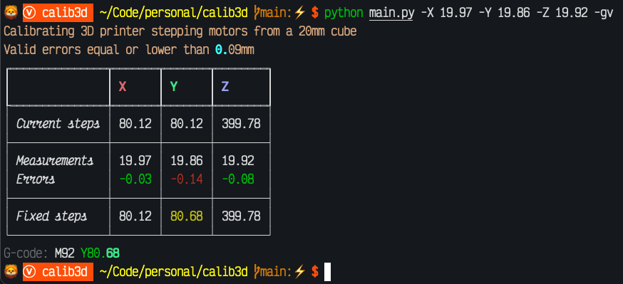

# calib3d

Helper to calibrate a 3D printer.



## Setup

1. Create a `config.yml` file in the working directory with the following structure:

```yaml
steps:
  X: 80.12
  Y: 80.12
  Z: 399.78
calcube:
  side: 20
  valid-error: 0.09
```

- `steps`: current steps defined in the 3D printer for each axis.
- `calcube`: calibration cube.
  - `side`: side of the calibration cube (mm).
  - `valid-error`: error that can be assumed (mm).

2. Optionally, create a `.env` file in the working directory to overwrite settings from [settings.py](settings.py).

3. Create a Python virtualenv and install requirements:

```console
$ python3.10 -m venv venv
$ source venv/bin/activate
$ pip install -r requirements.txt
```

## Usage

```console
$ python main.py --help
Usage: main.py [OPTIONS]

Options:
  -X FLOAT       Current measure (mm) for X axis from calibration cube
                 [required]
  -Y FLOAT       Current measure (mm) for Y axis from calibration cube
                 [required]
  -Z FLOAT       Current measure (mm) for Z axis from calibration cube
                 [required]
  -g, --gcode    Dump G-code
  -v, --verbose  Verbose mode
  -u, --update   Update fixed steps on config file
  --help         Show this message and exit.
```

- Dump G-code will output `M92` command **only for those axis** with errors outside confidence interval (`valid-error`).
- Update fixed steps on config file will **overwrite** the file `config.yml` with the calculated steps.

## References

- https://www.thingiverse.com/thing:1278865
- https://www.prusaprinters.org/prints/15140-better-3-axis-calibration-cube
- https://marlinfw.org/docs/gcode/M092.html
